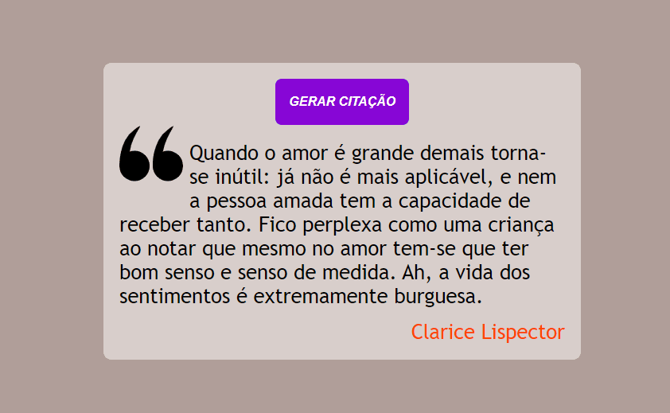

<h1 align="center">Gerador de Citações</h1>
<h2 align="center">Projeto produzido para praticar HTML, CSS e JavaScript</h2>
 

    

<h2>🚀🚀 Tecnologias 🚀🚀</h2>

* ✅ HTML
* ✅ CSS
* ✅ CSS

 
<h2> 💻📲 Como usar 💻📲 </h2>

* 📱💻 Baixe o Zip e execute o Index.html